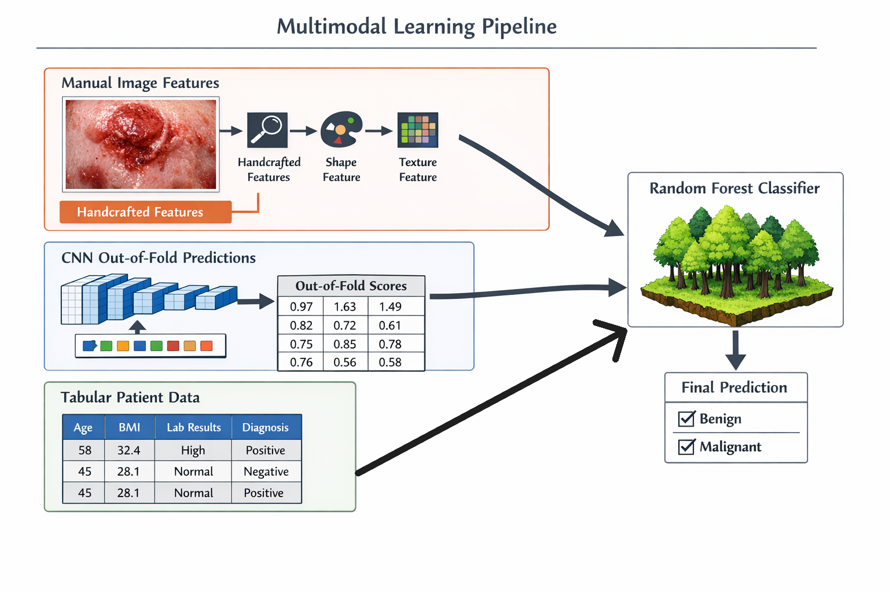

# Multimodal-Lesion-Classifier

## Project Overview
This project explores machine learning approaches to classify malignant skin lesions—Basal Cell Carcinoma (BCC), Malignant Melanoma (MEL), Squamous Cell Carcinoma (SCC), and Actinic Keratosis (ACK)—from benign skin abnormalities such as Melanocytic Nevus of Skin (NEV) and Seborrheic Keratosis (SEK). The pipeline uses small-scale classifiers (less than 10 million parameters) and combines handcrafted image features, DenseNet CNN out-of-fold predictions, and tabular patient data, with a Random Forest classifier for final predictions.

---

## Features
- **Multimodal Data:** Integrates image features, CNN predictions, and patient metadata.
- **Ensemble Learning:** Uses DenseNet for feature extraction and Random Forest for classification.
- **Age Group Analysis:** Evaluates performance across different age groups.

## Pipeline
1. **Data Processing:**
	- Loads and preprocesses image and tabular data.
	- See `data_processing.ipynb`.
2. **DenseNet Training:**
	- Trains a DenseNet on all age groups.
	- Produces out-of-fold predictions for development and test sets.
	- See `densenet.ipynb`.
3. **Feature Extension:**
	- Extends datasets with DenseNet predictions.
	- See `extend_dense.ipynb`.
4. **Random Forest Training:**
	- Trains and evaluates the final classifier.
	- See `forest_training.ipynb`.

## How to Run
1. Clone this repository and download the dataset (see below).
2. Run the notebooks in order:
	- `data_processing.ipynb`
	- `densenet.ipynb`
	- `extend_dense.ipynb`
	- `forest_training.ipynb`
3. Notebooks are compatible with Google Colab connect to a T4 GPU.

## Repository Structure
- `data_processing.ipynb` — Data loading and preprocessing
- `densenet.ipynb` — DenseNet training and prediction
- `extend_dense.ipynb` — Feature extension with CNN outputs
- `forest_training.ipynb` — Random Forest training and evaluation
- `figures/MultimodalFigure.png` — Pipeline overview figure

## Results
| Age Group | Accuracy |
|-----------|----------|
| Seniors   | 0.91477  |
| Adults    | 0.94583  |
| Young     | 1.00000  |

Evaluated on coarse labels.

## Dataset
- [Skin Lesion Dataset (used ~50%)](https://www.sciencedirect.com/science/article/pii/S235234092031115X)

## References
- Inspired by: [DenseNet and Data Augmentation](https://ieeexplore.ieee.org/document/11284542/)

